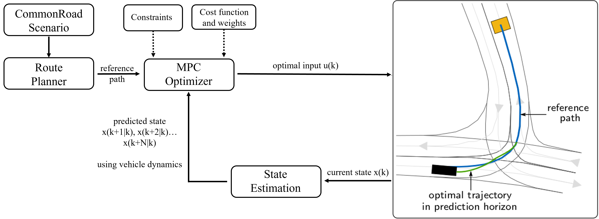
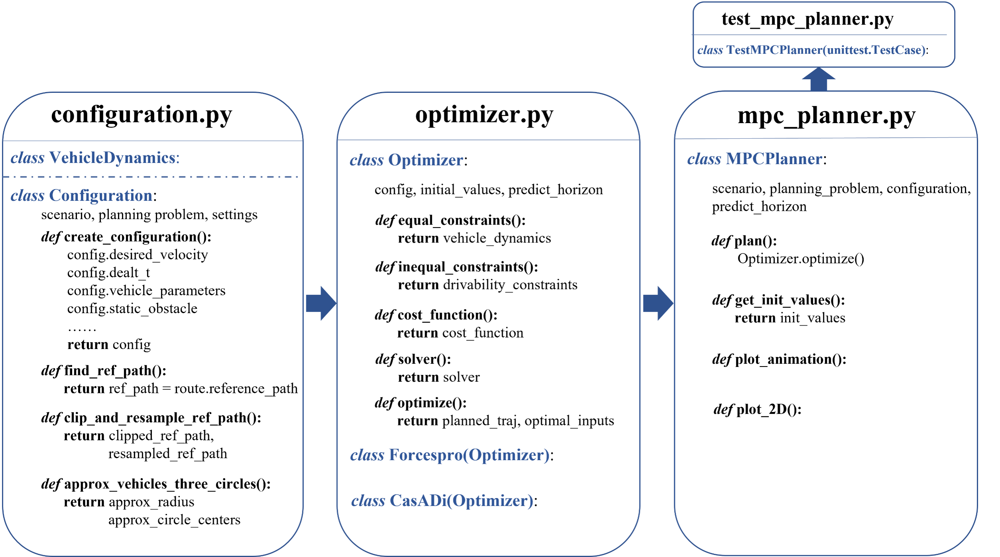
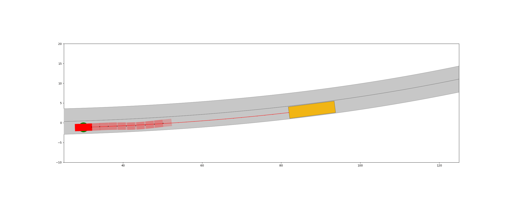
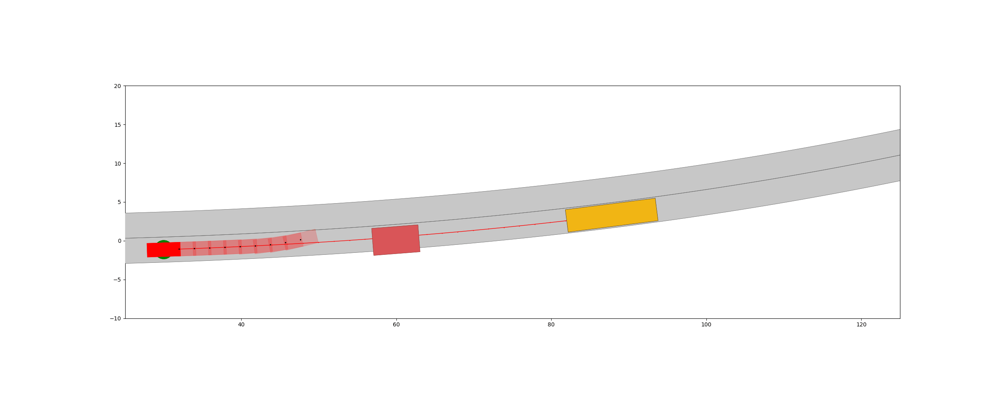
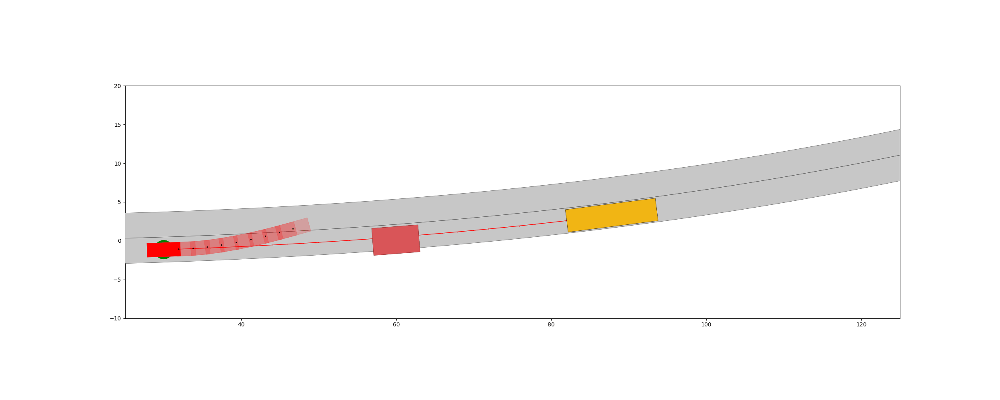

# Practical Course MPFAV WS21: Motion Planning Using Model Predictive Control within the CommonRoad Framework
## Description of repository
This repository is motion planning of autonomous driving using Model Predictive Control (MPC) based on [CommonRoad Framework](https://commonroad.in.tum.de/). We develop the algorithm with two tools, i.e., CasADi (IPOPT solver) and Forcespro (SQP solver), to solve the optimization problem. Finally, we used two use cases to evaluate our algorithms, i.e. lane following and collision avoidance.

The framework of our MPC Planner is following:



The high-level planner integrated with CommonRoad, `Route Planner`, uses in `CommonRoad scenario` as input and generates a reference path for autonomous vehicle from initial position to a goal position. Afterwards, the task of `MPC optimizer` is to utilize the reference path and `generate a feasible and directly executable trajectory`. As an optimization-based approach, cost function and constraints are indispensable, and the optimizer tries to minimize the cost function regarding prediction horizon under some constraints (e.g. vehicle dynamics, drivability constraints, and etc.) and implement the optimal control inputs at the current time step. It then computes an optimal control sequence starting from the updated vehicle state, and implements the computed optimal control input for one time step.This procedure is implemented in a receding horizon way until the vehicle arrives at its goal position. 

## Structure of repository
Three main modules stand in `MPC_Planner` folder: `configuration.py`, `optimizer.py` and `mpc_planner.py`. Their main functions are displayed in the following structure diagram.  

The test module and test results are in `test` folder. `test_mpc_planner.py` is an unittest for the algorithm.



## The required Python dependencies

- matplotlib>=3.4.3  
- numpy>=1.21.5
- cvxpy>=1.1.17
- ecos>=2.0.7
- casadi>=3.5.1
- commonroad-io>=2021.3
- commonroad-vehicle-models>=2.0.0
- commonroad-route-planner>=1.0.0
- commonroad-drivability-checker>=2021.1

For installation of commonroad packages, you can refer to [commonroad-vehicle-models>=2.0.0](https://gitlab.lrz.de/tum-cps/commonroad-vehicle-models), [commonroad-route-planner>=1.0.0](https://gitlab.lrz.de/tum-cps/commonroad-route-planner), [commonroad-drivability-checker>=2021.1](https://commonroad.in.tum.de/drivability-checker)

The installation of CasADi and Forcespro is following.

### Installation of CasADi
```
pip install casadi
```

### Installation of Forcespro
FORCESPRO is a client-server code generation system. The user describes the optimization problem using the client software, which communicates with the server for code generation (and compilation if applicable). The client software is the same for all users, independent of their license type.  

There are different FORCESRO Variants (S,M,L) and Licensing Nodes and their differences are shown in the following table:


This repository is using **Variant L** and **Engineering Node**. 

For more details, please refer to [here](https://www.embotech.com/products/forcespro/licensing/)

#### Academic Licences
Forcespro is free both for professors who would like to use FORCESPRO in their curriculum and for individual students who would like to use this tech in their research. 

Professors please go ahead and give a quick note using the [web form](https://www.embotech.com/products/forcespro/licensing/#et_pb_contact_form_0) below. 

Students, feel free to visit the [CUSTOMER PORTAL](https://my.embotech.com/) and go through the process. It will need the academic email address, a copy of student card/academic ID and signed version of the [Academic License Agreement](https://www.embotech.com/wp-content/uploads/2002-FORCES-PRO-Academic-License-Agreement.pdf). Please make sure you check the field “Academic Use”.  
>The detailed steps are following:
>- Select the button `Request License` from the [portal login page](https://my.embotech.com/) or follow the link from the Embotech web site to start the license registration proceedure
>- Fill out the initial form with your name, academic email address and the rest of the required information. Make sure you've checked the Academic Use checkbox
>- An email will be sent to you to validate the email address you have entered
>- Follow the link contained in that email to be redirected to the main registration form
>- Fill out the main registration form with the required information
>- Academic users will also need to upload the License Request Form (link exists in the form) as well as their Academic ID.
>- Submit the form by pressing the button `Request License`.
>- After submitting the main registration form, your registration will be overviewed by their licensing department.
>- When your account license has been approved you will receive a notification email that your account has been activated 
>- After `receiving a license`, if registered on the portal, the FORCESPRO client can be downloaded from the portal after assigning an Engineering Node. 
>- Unzip the downloaded client into a convenient folder.

Applying for Trial License (for one month), you can refer to [here](https://my.embotech.com/manual/registration?type=academic).
#### Commercial Licences
For commercial Licences, please refer to [COMMERCIAL LICENSES](https://www.embotech.com/products/forcespro/licensing/) and the detailed steps of [registration](https://my.embotech.com/manual/registration?type=commercial).


## Usage Example
### How to run
The script you need run is `./test/test_mpc_planner.py`. The algorithm has been tested in two scenarios `ZAM_Over-1_1`(without obstacle for lane following, with obstacle for collision avoidance) and `USA_Lanker-2_18_T-1`(for lane following). All required configurations of planner for each scenario or use case have been written in `./test/config_files/` with a .yaml file.

A tester only needs to change the config_name in line 16 of test_mpc_planner.py to test the scenario. You can also choose the framework_name to casadi or forcespro, or choose noised or unnoised situation in config_file. 
After running, the results (gif, 2D plots etc.) are shown in test folder.

For other [commonroad scenarios](https://commonroad.in.tum.de/scenarios), you can download, place it in `./scenarios` and create a config_file to test it.

### Results
Here are some gif results:  
Result of lane following in ZAM_Over-1_1 using CasADi:

Result of lane following in ZAM_Over-1_1 using Forcespro:

Result of lane following in USA_Lanker-2_18_T-1 using CasADi:

Result of lane following in USA_Lanker-2_18_T-1 using Forcespro:

Result of collision avoidance in ZAM_Over-1_1 using CasADi:

Result of collision avoidance in ZAM_Over-1_1 using Forcespro:


We can see that both CasADi and Forcespro perform well in these two scenarios. 2D plots for analysis are placed in `./test/` with corresponding folder name.

We also compare the computation time of CasADi and Forcespro using same scenario and same use case on same computer.

Here is an example comparison of lane following in ZAM_Over-1_1. It is obvious that  Forcespro with SQP solver is much more computationally efficient  (about  ten  times  faster)  than  CasADi  with  IPOPT solver.


## Literature

[Yi, B., Bender, P., Bonarens, F., & Stiller, C. (2018). Model predictive trajectory planning for automated driving. IEEE Transactions on Intelligent Vehicles, 4(1), 24-38.](https://ieeexplore.ieee.org/stamp/stamp.jsp?tp=&arnumber=8574950)

[Gutjahr, B., Gröll, L., & Werling, M. (2016). Lateral vehicle trajectory optimization using constrained linear time-varying MPC. IEEE Transactions on Intelligent Transportation Systems, 18(6), 1586-1595.](https://ieeexplore.ieee.org/stamp/stamp.jsp?arnumber=7593251)
