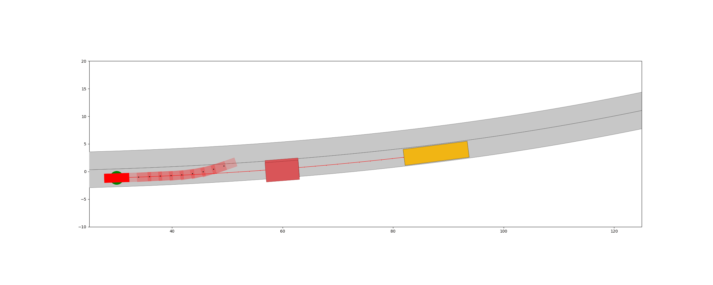

# Practical Course MPFAV WS21: Motion Planning Using Model Predictive Control within the CommonRoad Framework
## Description of repository
This repository is motion planning of autonomous driving using Model Predictive Control (MPC) based on CommonRoad Framework. We developed the algorithm with two tools, i.e. CasADi and Forcespro, to solve the optimization problem. Finally, we used two use cases to evaluate our algorithms, i.e. Lane Following and Collision Avoidance.

The framework of our MPC Planner is following:


## Structure of repository
`TBD`

## Installation
### Installation of Forcespro
FORCESPRO is a client-server code generation system. The user describes the optimization problem using the client software, which communicates with the server for code generation (and compilation if applicable). The client software is the same for all users, independent of their license type.  

There are different FORCESRO Variants (S,M,L) and Licensing Nodes and their differences are shown in the following table:


This repository is using **Variant L** and **Engineering Node**. 

For more details, please refer to [here](https://www.embotech.com/products/forcespro/licensing/)

#### Academic Licences
Forcespro is free both for professors who would like to use FORCESPRO in their curriculum and for individual students who would like to use this tech in their research. 

Professors please go ahead and give a quick note using the [web form](https://www.embotech.com/products/forcespro/licensing/#et_pb_contact_form_0) below. 

Students, feel free to visit the [CUSTOMER PORTAL](https://my.embotech.com/) and go through the process. It will need the academic email address, a copy of student card/academic ID and signed version of the [Academic License Agreement](https://www.embotech.com/wp-content/uploads/2002-FORCES-PRO-Academic-License-Agreement.pdf). Please make sure you check the field “Academic Use”.  
>The detailed steps are following:
>- Select the button `Request License` from the [portal login page](https://my.embotech.com/) or follow the link from the Embotech web site to start the license registration proceedure
>- Fill out the initial form with your name, academic email address and the rest of the required information. Make sure you've checked the Academic Use checkbox
>- An email will be sent to you to validate the email address you have entered
>- Follow the link contained in that email to be redirected to the main registration form
>- Fill out the main registration form with the required information
>- Academic users will also need to upload the License Request Form (link exists in the form) as well as their Academic ID.
>- Submit the form by pressing the button `Request License`.
>- After submitting the main registration form, your registration will be overviewed by their licensing department.
>- When your account license has been approved you will receive a notification email that your account has been activated 
>- After `receiving a license`, if registered on the portal, the FORCESPRO client can be downloaded from the portal after assigning an Engineering Node. 
>- Unzip the downloaded client into a convenient folder.

Applying for Trial License (for one month), you can refer to [here](https://my.embotech.com/manual/registration?type=academic).
#### Commercial Licences
For commercial Licences, please refer to [COMMERCIAL LICENSES](https://www.embotech.com/products/forcespro/licensing/) and the detailed steps of [registration](https://my.embotech.com/manual/registration?type=commercial).

### Installation of CasADi
```
pip install casadi
```

## Usage Example
### How to run
The script you need run is `./test/test_mpc_planner.py`, in which you can switch the solvers from `forcespro` to `casadi` and vice versa. After that, in `test` folder, you can see a folder called `figures + scenario_name`, where the figures of planning result are saved, and `a gif` which can intuitively show the planning result.

But before that, you should prepare for the commonroad-based scenario in `scenarios` folder, which you want to plan, and configuration file in `.test/config_files/` folder.



## Literature

[Yi, B., Bender, P., Bonarens, F., & Stiller, C. (2018). Model predictive trajectory planning for automated driving. IEEE Transactions on Intelligent Vehicles, 4(1), 24-38.](https://ieeexplore.ieee.org/stamp/stamp.jsp?tp=&arnumber=8574950)

[Gutjahr, B., Gröll, L., & Werling, M. (2016). Lateral vehicle trajectory optimization using constrained linear time-varying MPC. IEEE Transactions on Intelligent Transportation Systems, 18(6), 1586-1595.](https://ieeexplore.ieee.org/stamp/stamp.jsp?arnumber=7593251)

`To Be Appended...`
